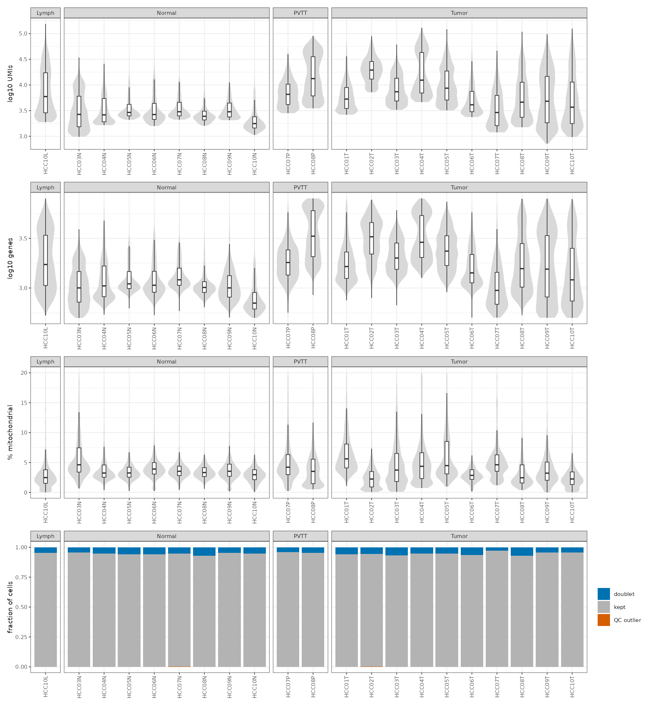
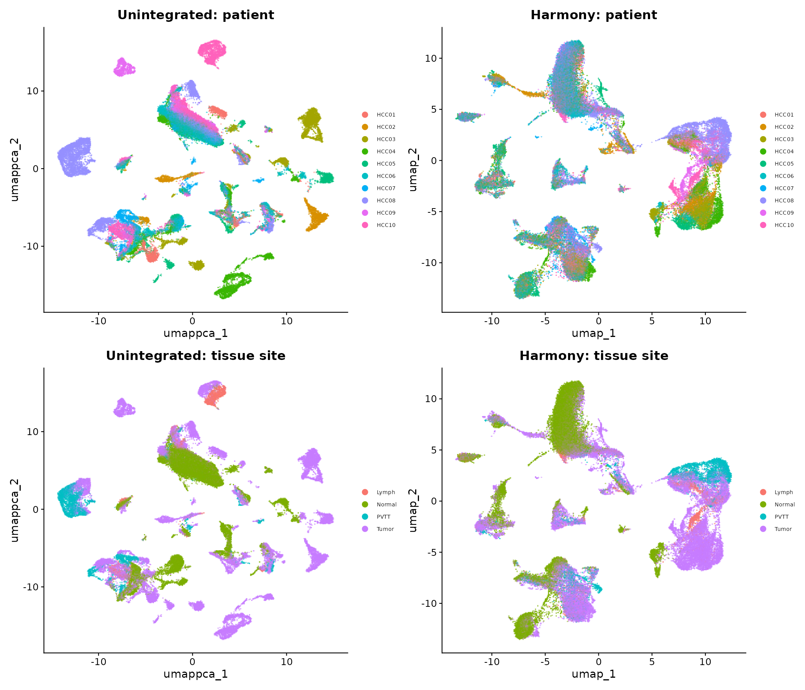
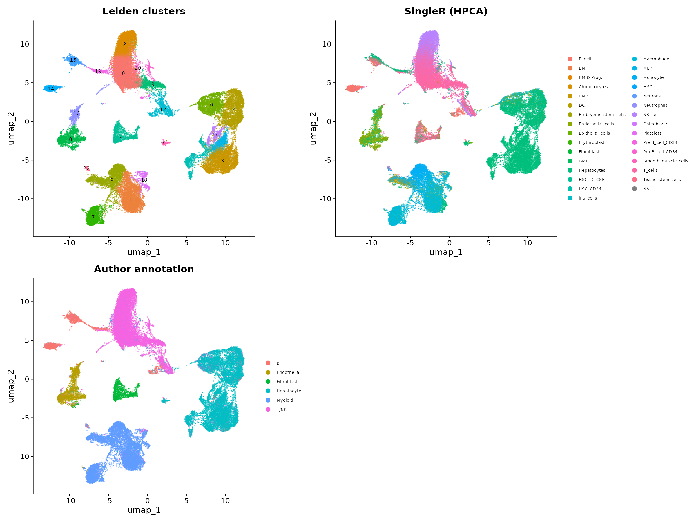
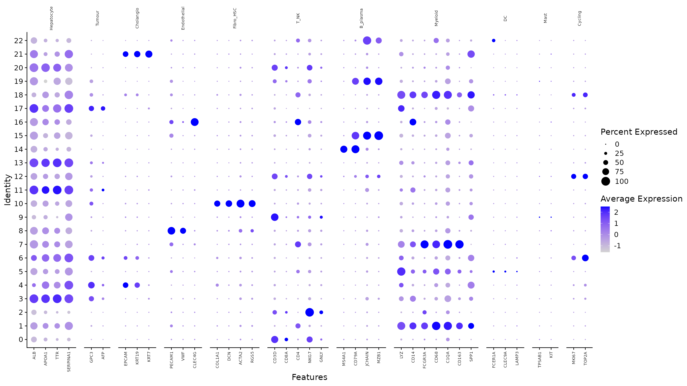

# hcc-singlecell

Single-cell analysis of human hepatocellular carcinoma (HCC): cellular heterogeneity across patients and tissue sites, and communication between tumour cells with stem-like features and immunosuppressive myeloid populations.

> **Status: work in progress.** The repository is developed in the open; see [Status](#status) for what is done.

## Objectives

1. Build an integrated, annotated single-cell atlas across patients and tissue sites.
2. Define cancer stem-like and immunosuppressive myeloid states and their molecular signatures.
3. Reconstruct myeloid differentiation trajectories.
4. Infer ligand–receptor communication between these compartments and prioritise candidate mediators.
5. *(Stretch)* Map the reference onto public spatial data (Xenium/Visium) and quantify colocalisation.

## Data

| Dataset | Type | Content |
|---|---|---|
| [GSE149614](https://www.ncbi.nlm.nih.gov/geo/query/acc.cgi?acc=GSE149614) (Lu et al., 2022) | scRNA-seq (10x) | ~70k cells, 10 patients; primary tumour, portal vein tumour thrombus, metastatic lymph node, non-tumour liver |
| Public 10x liver cancer dataset (TBD) | Xenium / Visium | Spatial validation (stretch goal) |

The analysis starts from the author-provided **raw count matrix** and cell metadata (no FASTQ re-processing). Consequently, spliced/unspliced counts are not available and RNA velocity is out of scope; trajectories rely on `slingshot` / `monocle3`.

Raw data are not tracked. `slurm/02_download.sh` retrieves them from GEO and records MD5 checksums.

## Analysis plan

| Step | Methods |
|---|---|
| QC | Lower-tail per-sample MAD outliers (UMIs, genes), absolute % mitochondrial cap, doublets with `scDblFinder` run per sample |
| Normalisation & integration | Log-normalisation, 3,000 HVGs (MT/ribosomal excluded), PCA, `Harmony` across **patients** |
| Integration assessment | Unintegrated vs integrated embeddings; kNN-based LISI for patient (mixing), tissue site and author cell type (should stay separated) |
| Clustering & annotation | Leiden clustering at several resolutions, UMAP, canonical markers, `presto` cluster markers, `SingleR` (HPCA) and comparison with the authors' labels |
| Malignant cells | `inferCNV` per patient (epithelial cells vs the patient's own immune/stromal cells); per-cell CNV score and correlation with the tumour's consensus profile; non-tumour epithelium as negative check |
| Cancer stem-like cells | EPCAM, PROM1, CD24, KRT19 module scores, cross-checked with a marker-independent potency score; restricted to malignant cells |
| Myeloid compartment | Re-analysis of myeloid cells alone (HVGs, PCA, Harmony, Leiden); immunosuppression programme score; tumour vs non-tumour enrichment of each state in paired patients |
| Differential expression | Pseudobulk `DESeq2` on raw counts, `~ patient + tissue` |
| Pathway enrichment | `fgsea` (Hallmark, Reactome) |
| Trajectories | `slingshot` / `monocle3` on myeloid cells |
| Cell–cell communication | `LIANA` consensus / `CellChat`; **differential** (tumour vs non-tumour) |
| Candidate prioritisation | Ranked mediators combining interaction score, ligand/receptor DE and tissue specificity |
| Spatial (stretch) | Reference mapping, niche detection, colocalisation statistics |

### Design decisions

- **Study design limits the comparisons.** Tumour and non-tumour tissue are paired in 8 of 10 patients, so tumour vs non-tumour tests are done within patients. Portal vein tumour thrombus (2 patients) and lymph-node metastasis (1 patient) are described, not tested.
- **QC is a re-assessment, and composition-aware.** The GEO matrix was already filtered by the authors (71,915 cells). A first pass with per-sample MAD thresholds on both tails removed 15% of cells, and not at random: upper-tail UMI outliers were 8.8% of non-tumour cells vs 0.8% of tumour cells. Liver samples mix small immune cells with large, mitochondria-rich hepatocytes, so the upper tail is a cell type rather than an artefact. Final rules: lower-tail MAD outliers (UMIs, genes) per sample, a single absolute mitochondrial cap (30%), and doublets removed with scDblFinder instead of an upper UMI cut-off. The rejected rules are still computed and tabulated by cell type (`results/tables/02_qc_flags_by_celltype.tsv`): a per-sample upper MAD on % mitochondrial would have removed 13% of hepatocytes (and 11% of endothelial cells) but 3% of T/NK cells, and the upper UMI rule 8–9% of myeloid, B and endothelial cells. With the final rules, 67,908 of 71,915 cells are kept; almost all removals are scDblFinder doublets (5.6%).
- **Log-normalisation rather than SCTransform.** Differential expression is done on raw counts at the pseudobulk level, so SCTransform would only affect the embedding, at a memory cost that matters on a cluster limited to 2 GB per CPU.
- **Integrate across patients, not tissue sites.** Tissue site is the biological signal of interest; correcting it would remove it.
- **Differential expression at the pseudobulk level** with the patient as blocking factor, so that tumour vs non-tumour comparisons are made within patients and cells are not treated as independent replicates.
- **Stem-like states are treated cautiously.** Cancer stem cells in HCC are a debated concept and four-marker scores are weak evidence on their own; they are only interpreted within CNV-confirmed malignant cells and alongside an independent potency estimate.
- **Myeloid-derived suppressor cells** are hard to separate from monocytes/neutrophils in scRNA-seq alone; states are named by function-associated programmes rather than by assumed identity.

## Results

### 1. Data and study design

71,915 cells from 21 samples (10 patients) were read from the author-provided count matrix; all cells matched the metadata. Tumour and non-tumour tissue are paired in 8 patients; PVTT is available for 2 patients and lymph-node metastasis for 1 ([`01_cells_per_patient_site.tsv`](results/tables/01_cells_per_patient_site.tsv)).

### 2. Quality control

The matrix had already been filtered by the authors: mitochondrial content stops sharply at 20% and UMIs have a hard lower bound in every sample. QC therefore re-assesses that filtering rather than repeating it.



Several tumour samples show bimodal UMI distributions (small immune cells vs large tumour/hepatocyte-like cells). Per-sample MAD thresholds on the upper tail would have removed cells by type rather than by quality:

| Author cell type | Cells | Upper-MAD % mito rule | Upper-MAD UMI rule |
|---|---:|---:|---:|
| Hepatocyte (incl. malignant) | 20,782 | 13.0% | 1.8% |
| Endothelial | 3,644 | 11.2% | 8.4% |
| Fibroblast | 2,266 | 9.1% | 4.2% |
| B | 3,685 | 5.3% | 9.3% |
| Myeloid | 15,947 | 4.2% | 8.8% |
| T/NK | 25,591 | 3.0% | 1.1% |

With the final rules, **67,908 cells** are kept; removals are almost entirely scDblFinder doublets (3–7% per sample) ([`02_qc_summary.tsv`](results/tables/02_qc_summary.tsv), [`02_qc_flags_by_celltype.tsv`](results/tables/02_qc_flags_by_celltype.tsv)).

### 3. Integration across patients

Harmony (batch = patient) raised the median patient LISI from 1.1 to 3.0 (10 patients), while cell-type LISI stayed at 1.0, i.e. patients mix within cell types and cell types are not merged. Tissue-site LISI barely moved (1.0 → 1.07), as intended: site is biology, not batch ([`03_integration_lisi.tsv`](results/tables/03_integration_lisi.tsv)).



Immune and stromal cells mix across patients after integration; hepatocyte-lineage cells remain partly patient-specific (one cluster is 67% from a single patient). That is expected for malignant cells, whose copy-number profiles differ between tumours, and is why malignant cells will be identified with inferCNV rather than by forcing further integration.

### 4. Clustering and first-pass annotation

Leiden clustering (resolution 0.5) gives 23 clusters; majority SingleR (HPCA) labels and the authors' labels agree with the markers for all major compartments ([`04_cluster_annotation.tsv`](results/tables/04_cluster_annotation.tsv), [`04_cluster_markers.tsv`](results/tables/04_cluster_markers.tsv)).





| Compartment | Clusters | Key markers |
|---|---|---|
| T / NK | 0, 2, 9, 12 (cycling) | CD3D, NKG7, GZMA, IL32; MKI67/TOP2A in 12 |
| Myeloid | 1, 5, 7, 18 (cycling), 22 | SPP1, CD68 (1); LYZ, HLA-DR (5); CD5L, C1QA, CD163 (7, Kupffer-like); LILRA4, IRF4 (22, pDC) |
| B / plasma | 14, 15 | CD79A; MZB1, JCHAIN, IGHG1 |
| Endothelial | 8, 16 | PECAM1, VWF; CLEC4G, FCN2, CRHBP (16, sinusoidal) |
| Fibroblast / stellate | 10 | ACTA2, TAGLN, COL1A2 |
| Hepatocyte-like | 3, 11, 13 | ALB, APOA1, TTR, ORM1, GSTA1 |
| Tumour-like | 4, 6 (cycling), 17 | GPC3, MDK, CD24, KRT8/18; SPINK1, AGR2 (17) |
| Cholangiocyte | 21 | EPCAM, KRT19, KRT7 |

Two observations guide the next steps: an **SPP1⁺ macrophage** cluster (1), a candidate immunosuppressive TAM population, and a **CD24⁺ MDK⁺ epithelial** cluster (4) with a proliferating counterpart (6), candidate stem-like tumour states. Both are hypotheses until malignant cells are confirmed by CNV and the myeloid compartment is sub-clustered. Clusters 19 (plasma-like, 76% one patient) and 20 (T cells with hepatocyte transcripts) are flagged as possible residual doublets or ambient RNA.

## Computing environment

The pipeline runs on a shared SLURM cluster (CentOS 7, glibc 2.17, no root access, per-user storage quota).

- **Environment:** conda-forge/bioconda via a user-level `micromamba` binary, defined in [`environment.yml`](environment.yml) (R 4.5, Seurat 5). Packages only available on GitHub (LIANA, CellChat, presto) are installed by `slurm/03_install_env.sh`, which also exports the exact versions (`environment.lock.yml`) and commit SHAs (`github_packages.tsv`).
- **Pipeline:** [`targets`](https://docs.ropensci.org/targets/) with local `crew` workers inside a single SLURM job; only outdated targets are re-run after a restart.
- **Storage budget:** ≤ 60 GB for the whole project (data, environment and target store); intermediate objects stored with `qs2`.

### Setup

```bash
cd /work/<user>/hcc-singlecell
sbatch slurm/00_check_env.sh      # cluster diagnostics (modules, network, quota, partitions)
sbatch slurm/01_test_conda.sh     # dry-run: can the environment be solved on this system?
sbatch slurm/02_download.sh       # GEO download + checksums
sbatch slurm/03_install_env.sh    # create env/, install GitHub packages, export lock files
sbatch slurm/05_download_refs.sh  # hg38 gene positions for inferCNV
sbatch slurm/10_run_pipeline.sh   # run or resume the targets pipeline
```

Each script writes a plain-text report (`*_report.txt`) so that runs can be inspected without an interactive session.

## Repository structure

```
hcc-singlecell/
├── README.md
├── environment.yml       # conda specification
├── _targets.R            # pipeline definition
├── R/                    # functions used by the pipeline (ingest, QC, ...)
├── slurm/                # setup and launch scripts
├── results/
│   ├── figures/
│   └── tables/
└── report/
    └── report.qmd        # Quarto HTML report
```

## Reproducibility

- Conda environment specification plus exported lock file; GitHub packages pinned by commit SHA
- Pipeline orchestrated with `targets` (cached, re-runs only what changed)
- Fixed random seeds for clustering and UMAP
- Session info included in the report

## Status

- [x] Cluster diagnostics and environment feasibility (conda solve on glibc 2.17)
- [x] Data download with checksums
- [x] Environment installation and lock files
- [x] QC (67,908 cells kept)
- [x] Integration and first-pass annotation
- [ ] Malignant-cell identification (inferCNV) *(code ready)*
- [ ] Myeloid states *(code ready)*
- [ ] Stem-like tumour states
- [ ] Differential expression and pathways
- [ ] Trajectories
- [ ] Cell–cell communication and candidate ranking
- [ ] Spatial mapping (stretch)
- [ ] Report published on GitHub Pages

## Reference

Lu Y, Yang A, Quan C, et al. A single-cell atlas of the multicellular ecosystem of primary and metastatic hepatocellular carcinoma. *Nature Communications* 13, 4594 (2022).

## Author

Antonio Puriel Hernández — PhD in Environmental Microbiology; bioinformatics (metagenomics, reproducible pipelines).
